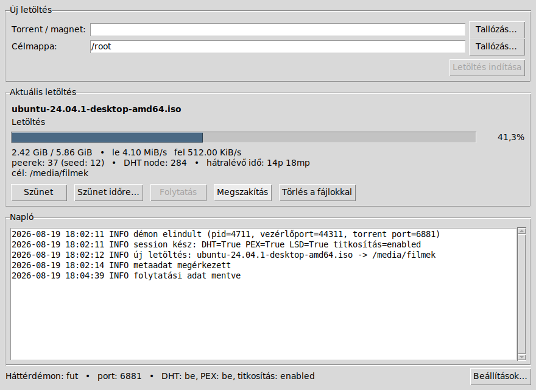

# torrentdl

[](https://github.com/manszabi/torrent_downloader/actions/workflows/tesztek.yml)

Egyszerű torrent letöltő Pythonban, [libtorrent](https://libtorrent.org/) motorral.
Egyszerre **egy** torrentet (vagy magnet linket) tölt, a háttérben fut, és
összeomlás után is folytatja onnan, ahol abbahagyta. Van grafikus felülete és
parancssori felülete is – mindkettő ugyanazt a háttérdémont vezérli.



## Mit tud

- **Forrás**: magnet link, helyi `.torrent` fájl vagy `.torrent` URL.
- **Célkönyvtár**: minden letöltésnél megadható (`-d`).
- **Háttérben fut**: a parancs kiadása után a démon dolgozik tovább; a terminál bezárható.
- **Folytatás**: a haladás (fast-resume) rendszeresen mentésre kerül, így áramszünet,
  összeomlás vagy kilépés után a letöltés folytatódik, nem indul elölről.
- **Szüneteltetés**: azonnal vagy megadott időre (`--for 30m`), ami után magától folytatódik.
- **Megszakítás/törlés**: a letöltés eldobható, ha kell, a már letöltött fájlokkal együtt.
- **Épség-ellenőrzés**: ha elkészült, a program újraellenőrzi az összes darabot, és csak
  akkor jelenti késznek, ha minden fájl ép — utána **alapállapotba** áll (nem seedel tovább),
  jöhet a következő torrent.
- **DHT**, **PEX**, **LSD** (helyi hálózati peer-keresés) — alapból bekapcsolva.
- **Titkosítás** (MSE/PE protokoll-titkosítás) — alapból bekapcsolva, kikényszeríthető.

## Indítás Windows alatt

Kattints duplán az **`inditas.bat`** fájlra. Ez megkeresi a Pythont, és átadja
a vezérlést az `indit.py`-nak, ami:

1. létrehoz egy **saját virtuális környezetet a `.venv` mappában** (csak az első
   indításkor), így a libtorrent nem a rendszer Pythonjába kerül, és nem
   keveredik más programok csomagjaival,
2. abban ellenőrzi a függőségeket, és szükség esetén telepíti a libtorrentet,
3. elindítja az ablakot.

Amint megnyílik az ablak, a fekete konzolablak eltűnik (hiba esetén visszajön
az üzenettel együtt), a háttérdémon pedig konzol nélküli Pythonnal indul – így
semmi nem ugrik a program ablaka elé.

Ha nincs Python a gépen, a parancsfájl megmondja, honnan töltsd le. A `.venv`
mappa bármikor törölhető: a következő indításkor újra elkészül. Ha nem kéred a
virtuális környezetet, a `TORRENTDL_NINCS_VENV=1` környezeti változóval
kikapcsolható.

> **Melyik Python kell?** A `libtorrent`-hez a készítői a **Python 3.13-ig**
> adnak kész csomagot, ennél újabb Pythonhoz (pl. 3.14) nincs. Az indító ezt
> felismeri: ha talál a gépen egy alkalmas változatot, azzal készíti el a
> `.venv`-et; ha nincs ilyen, kiírja, hogy telepítsd a 3.13-at (a meglévő
> Python maradhat mellette).

## Indítás máshol

```bash
python3 indit.py                     # ugyanaz, mint Windowson: .venv + felület
```

vagy kézzel, virtuális környezet nélkül:

```bash
pip install -r requirements.txt      # libtorrent
python3 -m torrentdl gui             # grafikus felület
python3 -m torrentdl status          # parancssor
# vagy telepítve:
pip install .                        # utána: torrentdl ... / torrentdl-gui
```

Python 3.10–3.13 és tkinter szükséges (a felső határt a libtorrent szabja meg;
a tkinter a Windows-telepítő része, Linuxon a `python3-tk` csomag). A
parancssori rész tkinter nélkül is működik.

## A grafikus felület

- **Torrent / magnet** mező: beilleszthető magnet link, vagy `.torrent` fájl
  tallózható; **Célmappa**: ide kerülnek a fájlok (a program megjegyzi).
- **Letöltés indítása** – amíg fut egy letöltés, a gomb inaktív (egyszerre egy
  torrent tölthető).
- **Szünet**, **Szünet időre…** (pl. `45s`, `30m`, `2h`, `1h30m` – egység nélkül
  perc), **Folytatás**, **Megszakítás**, **Törlés a fájlokkal** (rákérdez).
- Alul a **napló** a háttérdémon üzeneteit mutatja, a státuszsor pedig a démon
  állapotát, a portot, a DHT/PEX és a titkosítás beállítását.
- A **Beállítások…** ablakban állítható a port, a sebességkorlátok, a
  kapcsolatszám, a titkosítás módja és a DHT/PEX/LSD/µTP; mentés után a démon
  újraindul, a letöltés pedig ott folytatódik, ahol tartott.
- Az ablak bezárása **nem** szakítja meg a letöltést: a háttérdémon tovább
  dolgozik, és az ablak újranyitásakor ott folytatódik a kijelzés.

## Használat parancssorból

```bash
# letöltés indítása (magnet link vagy .torrent fájl)
torrentdl add "magnet:?xt=urn:btih:..." -d /media/filmek
torrentdl add ~/Letoltesek/valami.torrent -d /media/filmek

# hol tart?
torrentdl status
torrentdl status -w            # folyamatosan frissülő nézet (Ctrl+C a kilépéshez)

# szüneteltetés
torrentdl pause                # amíg vissza nem indítod
torrentdl pause --for 45m      # 45 perc múlva magától folytatja (45s, 2h, 1h30m is jó)
torrentdl resume

# megszakítás
torrentdl check                     # fájlok ellenőrzése; a hibás részt újratölti
torrentdl cancel                    # a részben letöltött fájlok a helyükön maradnak
torrentdl cancel --delete-files     # a fájlokat is törli (rákérdez; -y kihagyja)

# háttérdémon
torrentdl daemon status
torrentdl daemon stop          # a letöltés állapota megmarad, később: torrentdl resume
torrentdl daemon log -n 50     # napló
```

Példa állapotkijelzés:

```
Név:      ubuntu-24.04.1-desktop-amd64.iso
Állapot:  letöltés
Haladás:  [############------------------]  41.3%
Méret:    2.42 GiB / 5.86 GiB
Sebesség: le 4.10 MiB/s | fel 512.00 KiB/s | peerek: 37 (seed: 12) | DHT node: 284
Hátralévő idő: 14p 20mp
Cél:      /media/filmek
```

## Beállítások

```bash
torrentdl config                                  # aktuális beállítások
torrentdl config --set max_download_rate=2048     # kB/s, 0 = korlátlan
torrentdl config --set encryption=forced
torrentdl daemon stop                             # a változások újraindítás után lépnek életbe
```

| kulcs | alapérték | jelentés |
|---|---|---|
| `listen_port` | 6881 | bejövő kapcsolatok portja |
| `enable_dht` | true | DHT (tracker nélküli peer-keresés) |
| `enable_pex` | true | Peer Exchange |
| `enable_lsd` | true | helyi hálózati peer-keresés |
| `enable_utp` | true | µTP transzport |
| `enable_upnp` / `enable_natpmp` | true | portnyitás a routeren |
| `encryption` | enabled | `disabled` / `enabled` (ha a peer is tudja) / `forced` (csak titkosítva) |
| `max_download_rate` | 0 | letöltési korlát kB/s-ban (0 = korlátlan) |
| `max_upload_rate` | 0 | feltöltési korlát kB/s-ban |
| `max_connections` | 200 | egyidejű kapcsolatok száma |
| `seed_after_complete` | false | ha `true`, a kész letöltést megosztja tovább (lásd lent) |
| `resume_save_interval` | 30 | ennyi másodpercenként menti a folytatási adatot |
| `verify_after_crash` | true | nem tiszta leállás után teljes fájlellenőrzés |
| `idle_timeout` | 600 | ennyi tétlen másodperc után a démon kilép (0 = soha) |

## Megosztás a letöltés után

Alapból a program a sikeres ellenőrzés után alapállapotba áll, és nem oszt meg
tovább semmit. Ha a `seed_after_complete` beállítás `true`, akkor a kész torrent
a megosztásban marad:

- a felület `megosztás` állapotot mutat a feltöltött mennyiséggel,
- a démon nem lép ki tétlenség miatt, és **a program bezárása, illetve a gép
  újraindítása után is folytatja a megosztást** (a mentett állapotból),
- a megosztás bármikor lezárható a **Megosztás vége** gombbal (a fájlok
  maradnak) vagy a **Törlés a fájlokkal** gombbal,
- új letöltés indítása közben nem kell külön leállítani: az előző torrent
  megosztása magától véget ér.

## Adatvesztés: mi történhet, és mit tesz a program

Torrentnél minden darabnak van ellenőrző összege, így a sérülés **felismerhető**,
és a hibás rész **újratölthető**. A program erre épít:

| Eset | Mikor fordul elő | Mit tesz a program |
|---|---|---|
| Áramszünet, összeomlás, kilőtt folyamat | Windows és Linux | A lemezre még ki nem írt darabok elveszhetnek, miközben a mentett állapot késznek hiszi őket. Ezért a program **minden nem tiszta leállás után teljes ellenőrzést futtat**, és ami hiányzik vagy sérült, azt újratölti. |
| Hibás darab a hálózatról | mindkettő | A libtorrent minden darabot ellenőriz; a hibásat eldobja és újratölti. A felület kiírja, hányszor fordult elő. |
| Fájl megsérül vagy eltűnik a lemezen (vírusirtó karantén, kézi törlés, fájlrendszer-hiba) | mindkettő | Olvasási/írási hibánál a program magától ellenőrzést futtat, és újratölti az érintett részt (legfeljebb 3 kör, utána megáll és szól). Bármikor kérhető kézzel is: **Ellenőrzés** gomb / `torrentdl check`. |
| Betelt a lemez | mindkettő | Nem próbálkozik vakon (az újratöltés is ugyanabba a hibába futna): megáll, és kiírja, hogy nincs elég hely. Helyfelszabadítás után **Folytatás**. |
| Külső meghajtó leválasztva, megváltozott betűjel (Windows), lecsatolt kötet (Linux) | mindkettő | Felismeri, hogy a célmappa nincs meg, és **nem kezd újra letölteni máshová** – megáll, és szól, hogy csatlakoztasd a meghajtót. |
| A program saját állapotfájljai (haladás, folytatási adat) | mindkettő | Minden mentés atomi: ideiglenes fájlba ír, `fsync`, majd névcsere (Linuxon a könyvtár bejegyzését is szinkronizálja). Félbeírt állapotfájl így nem keletkezik; ha mégis olvashatatlan, a program teljes ellenőrzéssel indul. |

Windowson külön érdemes tudni:

- a **vírusirtó** (Defender) karanténba teheti vagy zárolhatja a fájlt letöltés
  közben – ilyenkor a program ellenőriz és újratölt, de a tartós megoldás egy
  kivétel felvétele a célmappára;
- a **260 karakteres útvonalkorlát** mély könyvtárszerkezetű torrentnél hibát
  adhat: válassz rövidebb célmappát, vagy kapcsold be a hosszú útvonalakat;
- alvó állapot/hibernálás után a letöltés magától folytatódik.

Linuxon a lecsatolt vagy csak olvashatóra váltott fájlrendszer viselkedik
ugyanígy: a program megáll és szól, nem tölt újra rossz helyre.

Ha nagyon nagy torrenttel dolgozol, és nem akarod, hogy összeomlás után
végigellenőrizze a fájlokat (ez több perc is lehet), kikapcsolható:
`torrentdl config --set verify_after_crash=false`.

## Hogyan működik

- A `torrentdl` parancsok és az ablak egy háttérdémonnal beszélgetnek: a démon a
  hurokcímen (`127.0.0.1`) figyel egy szabad porton, a portot és a hozzá tartozó
  jelszót a `daemon.endpoint` fájl tartalmazza (csak a felhasználó olvashatja).
  Így a megoldás Windowson is működik, és más felhasználó nem vezérelheti a
  letöltést. A démon az első `add` / `resume` parancsra magától elindul, és
  egyszerre csak egy futhat belőle (fájlzár, ami összeomlás után magától
  felszabadul).
- Az adatkönyvtár alapból `~/.local/share/torrentdl` (felülírható a `TORRENTDL_HOME`
  környezeti változóval). Itt található:
  - `job.json` – az aktuális letöltés állapota (ezt olvassa a `status` akkor is, ha nem fut a démon)
  - `resume.dat` – a libtorrent folytatási adata (melyik darab van meg)
  - `current.torrent` – a torrent metaadatának másolata, hogy magnet link is folytatható legyen
  - `session.state` – DHT-node gyorsítótár, `last.json` – az utolsó befejezett letöltés
  - `daemon.log` – napló, `daemon.lock` – egypéldány-zár, `daemon.endpoint` – port és jelszó
- Amikor a letöltés eléri a 100%-ot, a program `force_recheck`-kel újraellenőrzi az összes
  darabot. Ha minden ép: a torrentet eltávolítja a session-ből, törli a munkaállományokat,
  és alapállapotba áll. Ha hibát talál, a hiányzó darabokat újratölti (legfeljebb kétszer,
  utána hibaállapotba kerül, és a `status` kiírja az okot).
- Egyszerre csak egy letöltés lehet aktív: ha van futó munka, az `add` hibaüzenettel
  elutasít. Kivétel a kész torrent megosztása – azt az új letöltés indítása lezárja.

## Fájlok

| fájl | mit csinál |
|---|---|
| `inditas.bat` | Windows-indító: megkeresi a Pythont, elindítja az `indit.py`-t |
| `indit.py` | `.venv` létrehozása, függőség-ellenőrzés (Python-verzió, tkinter, libtorrent), majd a felület indítása |
| `torrentdl/gui.py` | a grafikus felület (tkinter) |
| `torrentdl/cli.py` | a parancssori felület |
| `torrentdl/engine.py` | a háttérdémon: libtorrent session, állapotgép, vezérlőcsatorna |
| `torrentdl/client.py` | a démon indítása és vezérlése (ezt hívja a GUI és a CLI is) |
| `torrentdl/config.py`, `format.py`, `lock.py`, `naplo.py`, `protocol.py` | beállítások, formázás, egypéldány-zár, naplóolvasás, protokoll |
| `ruff.toml`, `pyproject.toml` | a statikus elemzés és a típusellenőrzés beállításai |
| `requirements-dev.txt` | a fejlesztői eszközök rögzített verziói (ruff, mypy) |
| `.github/workflows/tesztek.yml` | a GitHubon automatikusan futó ellenőrzés |

## Tesztek

Minden teszt hálózat nélkül fut:

```bash
python3 tests/futtato.py        # mind egyben (a statikus elemzéssel együtt)
```

A futtató a tesztek mellett lefuttatja a **ruff** (hibaminták, stílus,
teljesítmény) és a **mypy** (típusellenőrzés) ellenőrzést is, ha telepítve
vannak:

```bash
pip install -r requirements-dev.txt   # rögzített ruff- és mypy-verzió
ruff check .        # külön is
mypy torrentdl
```

- `tests/smoke_test.py` – a letöltő motor: kész fájlok ellenőrzése és
  alapállapotba állás, szüneteltetés időzítéssel, `SIGKILL` utáni folytatás,
  törlés a fájlokkal, megosztás újraindítás után, **sérült fájl felismerése és
  újratöltése**, nem tiszta leállás utáni ellenőrzés, leválasztott meghajtó,
  valamint a hibafelismerés és a session-statisztika egységtesztjei.
- `tests/gui_test.py` – valódi Tk ablakkal: indítás, hibás forrás kezelése,
  gombok engedélyezése, szünet/folytatás, törlés (Linuxon `xvfb-run` kell hozzá,
  a futtató magától használja).
- `tests/bat_test.py` – a `.bat` fájl CRLF sorvégei, ASCII tartalma, `goto`
  címkéi (ezeken szokott elcsúszni a `cmd.exe`).
- `tests/indit_test.py` – az indító függőség-ellenőrzései, a `.venv` kezelése
  és a Python-verzió választása.

### Automatikus ellenőrzés (CI)

Ugyanez fut le magától a GitHubon minden feltöltésnél és minden
pull requestnél, a `.github/workflows/tesztek.yml` szerint:

| ellenőrzés | hol fut |
|---|---|
| teljes tesztkészlet (`tests/futtato.py`) | Linuxon és **Windowson**, Python 3.10–3.13 |
| statikus elemzés (`ruff check .`) | Linux, Python 3.13 |
| típusellenőrzés (`mypy torrentdl`) | Linux, Python 3.13 |

A Windows azért van benne, mert a program elsősorban oda készült: az indító
parancsfájl, a konzolablak nélküli démonindítás és a Tcl/Tk könyvtár
beállítása csak ott mérhető meg igazán. A grafikus felület tesztjéhez Linuxon
a futtató `xvfb-run`-t használ.

A ruff és a mypy verziója a `requirements-dev.txt`-ben rögzített, hogy egy új
kiadásuk ne buktasson el egy változatlan kódbázist.

## Erőforrás-használat

A háttérdémon egyetlen torrentet kezel, és igyekszik keveset fogyasztani:

- tétlenül ritkábban ébred (2 mp), munka közben sűrűbben (0,5 mp) – mérve
  ~0,5% CPU egy letöltés alatt, peerek nélkül;
- az állapotfájlt csak akkor írja újra, ha tényleg változott valami, és a
  rendszeres haladás-mentésnél nem kényszeríti lemezre (`fsync`) – így egy
  többórás letöltés sem terheli fölöslegesen az SSD-t;
- a napló olvasása a felületen csak a fájl utolsó 64 kB-jából történik, és csak
  akkor, ha a fájl változott;
- a lemezoldali beállítások a libtorrent ajánlásait követik: külön szálak a
  hash-számításhoz (gyorsabb ellenőrzés), nagyobb fájlgyorsítótár (sok fájlból
  álló torrenthez és a Windows vírusirtójához), és megnyirbált peer-lista
  (egyetlen torrenthez nem kell több ezer peer nyilvántartása).

## Jogi megjegyzés

A program csak letöltőmotor; azért, hogy milyen tartalmat töltesz le vele, a felhasználó felel.
